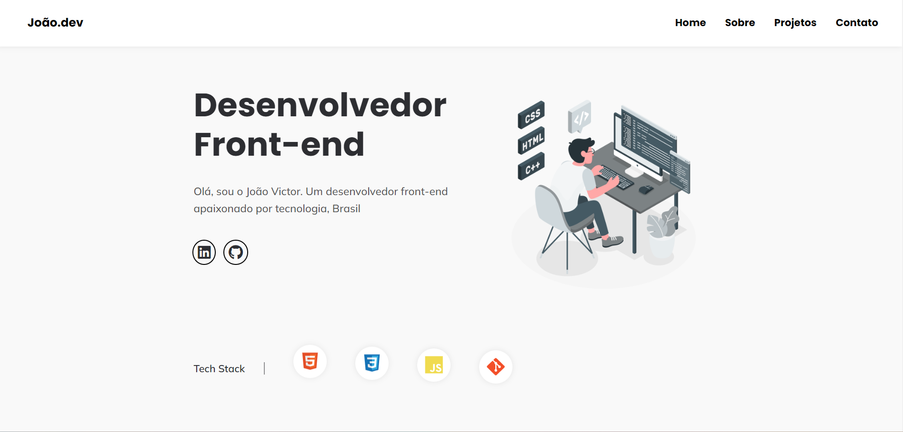

<h1 align="center" id="topo">Meu Portfólio </h1>

### 💻 Projeto

Meu portfólio.
 

---

### 🔧 Ferramentas

O projeto foi desenvolvido com as seguintes ferramentas:

#### 🧪 Tecnologias

- HTML
- CSS
- JavaScript

---

### 🚀 ​ [Clique aqui](https://joaodev2005.github.io/portfolio.github.io/)🔗 e veja o projeto no ar.

---

### ​👷‍♂️​ Acessar o Projeto

<a href="https://github.com/joaodev2005/portfolio.github.io/tree/main">Acesse aqui</a>🔗 o código fonte pelo GitHub.

### 📝 License

Esse projeto é licenciado pela MIT License. Clique [aqui](https://pt.wikipedia.org/wiki/Licen%C3%A7a_MIT)🔗 para mais detalhes.

---

#### 💬 Sinta-se a vontade para entrar em contato

  

---

> Desenvolvido com ❤️ por **João Victor** 

---

## Alterações recentes

- 2026-01-02: Refatorado `index.html` para HTML semântico e padrões modernos:
	- Usei elementos semânticos: `header`, `nav`, `main`, `section`, `article`, `footer`.
	- Melhorei acessibilidade: `aria-*`, `skip-link`, labels em botões e links, `alt` em imagens.
	- Reordenei carregamento de CSS (reset → styles → media queries) e carreguei Font Awesome com `defer`.
	- Atualizei estrutura de projetos para usar `article` e listas para stacks.
	- Pequenas correções: remoção de IDs duplicados e fechamento duplicado de tags.

Se quiser, posso também ajustar pequenos estilos no CSS para combinar com a nova estrutura semântica.
